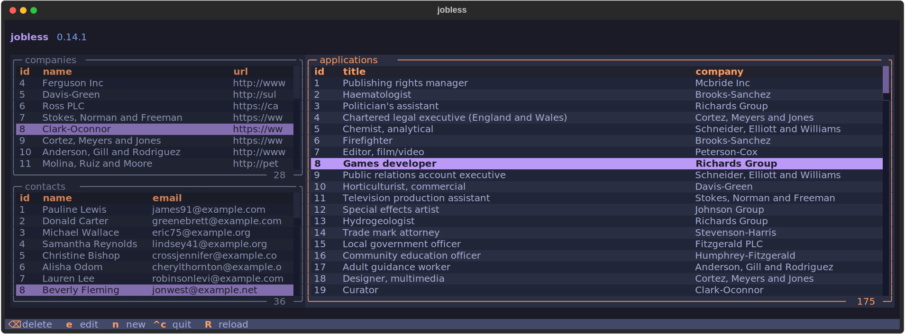

# jobless

**A simple job application manager for your terminal.**

jobless is a simple, easy-to-use job application manager that lives in your terminal built with the goal of replacing cluttered spreadsheets and infinite browser bookmarks.



## Features

- Manage applications, companies, and contacts all in one interface that understands and lets you build relationships between them.
- Navigate, create, and update without ever lifting your hands from the home row.
- Local-first SQLite backend.

## Roadmap (WIP)

- full-text search.
- Advanced filtering.
- AI-Assisted pipeline.
- `$EDITOR` integration.

## Installation

jobless can be installed via [`uv`](https://docs.astral.sh/uv/getting-started/installation/) on MacOS, Windows, and Linux:

```bash
uv tool install --python 3.14 jobless

# or to use it without installing.
uvx --python 3.14 jobless
```

### `pipx`?

If you prefer `pipx` is as easy as to run `pipx install jobless`.
